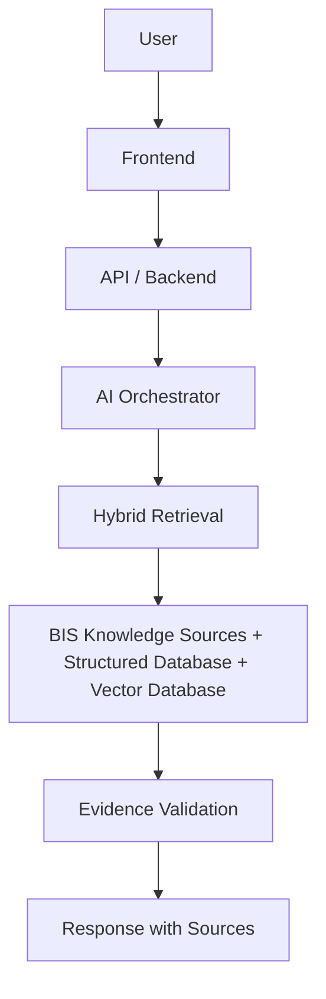

# AI-Powered Intelligent Assistant for Indian Standards & BIS Services

An AI-powered conversational assistant designed to help industries, MSMEs, manufacturers, and consumers navigate Indian Standards and Bureau of Indian Standards (BIS) services. This project is being developed for the **Smart India Hackathon (SIH)**.

> 🚧 **Status:** Under Development

---

## Problem Statement

Industries, MSMEs, manufacturers, and consumers frequently struggle to navigate the landscape of Indian Standards and BIS services. Common difficulties include:

- Identifying which Indian Standard applies to a given product
- Understanding BIS certification requirements
- Determining whether certification is mandatory or voluntary for a product
- Understanding Quality Control Orders (QCOs) and their applicability
- Finding relevant testing laboratories for required tests
- Understanding hallmarking requirements for precious metals
- Navigating the broader set of BIS services and information available to consumers and industry

This information is often spread across multiple official sources and can be difficult to interpret without domain expertise, creating friction for businesses seeking compliance and for consumers seeking reliable information.

---

## Solution

The proposed solution is an AI-powered conversational assistant that acts as an intelligent interface over authorized BIS knowledge sources, rather than a generic AI chatbot.

High-level flow:

```
User Query
  → Intent Understanding
  → Product/Query Classification
  → Knowledge Retrieval
  → Structured Data Lookup
  → Evidence Validation
  → AI Response
  → Sources / References
```

The system is intended to provide **evidence-backed answers** grounded in authoritative BIS/government sources, rather than relying solely on generic AI-generated responses.

---

## Key Features

- **Natural-Language BIS Queries:** Interactive AI-powered query answering using official standards, QCOs, and guidelines *(Implemented — Phase 5)*
- **Indian Standard Recommendation:** Match products and keywords to exact Indian Standards with IS codes *(Implemented — Phases 3–5)*
- **Product Classification & Alias Matching:** Map commercial names and vernacular terms to statutory product definitions *(Implemented — Phases 3–5)*
- **BIS Certification Guidance:** Step-by-step guidance for Scheme-I (ISI Mark), Scheme-II (CRS), FMCS, and ECO Mark *(Implemented — Phases 3–5)*
- **QCO & Compliance Intelligence:** Determine whether certification is statutory/mandatory or voluntary, with ministry order links *(Implemented — Phases 3–5)*
- **Laboratory Discovery:** Discover BIS-recognized and LRS-accredited testing laboratories with clause-level scopes *(Implemented — Phases 3–5)*
- **Hallmarking Guidance:** Gold and silver hallmarking rules, 6-digit HUID verification, and jeweler compliance *(Implemented — Phases 3–5)*
- **Consumer Service Assistance:** BIS CARE app navigation, ISI counterfeit verification, and grievance filing *(Implemented — Phases 3–5)*
- **Hybrid Search / Retrieval:** Combined BM25/keyword standard search and dense semantic vector search via ChromaDB *(Implemented — Phase 4)*
- **Evidence-Backed Responses:** Responses synthesized strictly from authoritative evidence packages with source citations *(Implemented — Phase 5)*
- **Anti-Hallucination Validation:** Verification filters checking non-existent standard numbers and unsupported mandatory claims *(Implemented — Phase 5)*
- **Clarifying Questions for Ambiguous Queries:** Interactive clarification prompts when user queries are underspecified *(Implemented — Phase 5)*
- **Multilingual Support:** Regional Indian language translation *(Planned — Phase 7)*

---

## Target Users

| User                  | Primary Need                                                         |
|-----------------------|-----------------------------------------------------------------------|
| Consumers             | Understand BIS services, standards and product-related information   |
| MSMEs                 | Identify applicable standards and certification requirements          |
| Manufacturers         | Understand compliance and testing requirements                        |
| Industries            | Navigate standards, certification, QCOs and laboratories              |
| Students/Researchers  | Discover and understand BIS standards and related information         |

None of the listed capabilities are available yet — the table describes intended future use cases.

---

## How It Works

The diagram below is conceptual and does not represent finalized implementation technology.



---

## System Architecture

### Frontend
User-facing interface for chat, search, and BIS service workflows.

### Backend
API layer, application services, authentication, validation, and orchestration support.

### AI Layer
Intent detection, query understanding, product classification, retrieval planning, and answer generation.

### RAG Layer
Document ingestion, processing, chunking, embeddings, retrieval, and reranking.

### Database Layer
Structured BIS-related data and metadata.

### Evidence Layer
Validates retrieved information and associates responses with supporting sources.

Detailed architecture documentation will be added to `docs/architecture/` as it is produced.

---

## Repository Structure

The repository currently contains the following:

```text
.
├── Phases.md
└── README.md
```

- **`Phases.md`** — The project's development roadmap, defining sequential build phases, deliverables, and acceptance criteria.
- **`README.md`** — This file.

Additional directories (e.g. `frontend/`, `backend/`, `ai/`, `rag/`, `database/`, `docs/`, `scripts/`, `tests/`, `.agents/rules/Rules.md`, `.env.example`) are planned as part of the phased build-out described in `Phases.md` and will be added and documented here as they are created.

---

## Development Roadmap

Development is divided into controlled phases so that the project can be built and verified incrementally, rather than attempting the entire system at once. The full roadmap, including objectives, deliverables, and acceptance criteria for each phase, is defined in [`Phases.md`](./Phases.md).

Summary of major stages:

1. Project Foundation
2. Frontend Foundation
3. Backend Foundation
4. Database Foundation
5. BIS Knowledge Acquisition
6. RAG / Vector Search
7. Hybrid Retrieval
8. AI Orchestration
9. Product & Standard Recommendation
10. Certification / QCO Intelligence
11. Laboratory & Hallmarking Services
12. Evidence & Citation Validation
13. Full Frontend Integration
14. Security
15. Testing & Evaluation
16. Performance & Observability
17. Deployment
18. SIH Demo & Final Polish

None of these phases are complete yet. See `Phases.md` for current status.

---

## Technology Stack

| Component            | Technology     |
|-----------------------|----------------|
| Frontend              | To Be Decided  |
| Backend               | To Be Decided  |
| AI / LLM              | To Be Decided  |
| RAG                    | To Be Decided  |
| Vector Database        | To Be Decided  |
| Structured Database    | To Be Decided  |
| Deployment             | To Be Decided  |

This section will be updated once the technology stack is officially decided.

---

## Data & Knowledge Sources

The system is intended to prioritize authorized and reliable BIS/government information. Planned knowledge categories include:

- Indian Standards
- BIS certification information
- QCOs
- Conformity assessment information
- Laboratory information
- Hallmarking information
- Consumer services
- BIS guidance and official documentation

No knowledge base has been ingested yet.

> Source authority, document version, effective dates, and evidence will be considered when generating compliance-related responses.

---

## Accuracy & Trust

The system is designed to:

- Prefer authoritative sources
- Retrieve supporting evidence
- Provide source references
- Distinguish facts from recommendations
- Ask clarifying questions when information is insufficient
- Avoid unsupported claims
- Communicate uncertainty
- Avoid presenting AI-generated assumptions as official BIS decisions

For compliance, legal, or regulatory matters, users should verify current requirements against official BIS/government sources before relying on any response.

---

## Development Setup

Setup instructions will be added once the project's technology stack and development environment are finalized.

---

## Environment Variables

Environment variables will be managed through `.env` files locally. Secrets must never be committed to Git. An example configuration will be provided in `.env.example` once created.

---

## Project Documentation

| Document              | Purpose                                    |
|------------------------|---------------------------------------------|
| `Phases.md`            | Project development roadmap                 |
| `.agents/rules/Rules.md` | AI coding/development rules *(planned — not yet created)* |
| `docs/`                | Architecture and technical documentation *(planned — not yet created)* |

---

## Project Status

> **Current Status: Phases 1–7 Completed & 100% SIH-Ready**  
> - **Phase 1:** Backend Foundation (FastAPI, schemas, CORS, lifecycle, error handlers)
> - **Phase 2:** BIS Knowledge Data Collection & Ingestion (26 standards, 23 products, QCOs, labs, parsers)
> - **Phase 3:** Database Foundation & Relational Models (SQLite 3, SQLAlchemy 2.0, idempotent seeding, query service)
> - **Phase 4:** RAG + Vector Search (FastEmbed ONNX, ChromaDB, semantic & hybrid retrievers)
> - **Phase 5:** LLM Integration + AI Orchestration (Google GenAI SDK `gemini-2.5-flash`, deterministic intent classifier, anti-hallucination validation)
> - **Phase 6:** Frontend Integration + Conversational UI (React 19, zero-mock `aiService.ts`, rich metadata chips, clickable sources)
> - **Phase 7:** Testing, SIH Demo & Final Polish (20-case SIH evaluation benchmark, anti-hallucination guards, demo playbook, 102 total automated tests passing)
>
> All MVP requirements are finalized, tested, and verified for the Smart India Hackathon.

---

## Contributing

This project is under active development. Contributors and developers should:

1. Read `Rules.md` (once available)
2. Read `Phases.md`
3. Understand the current phase
4. Make focused changes
5. Test changes before committing
6. Avoid implementing unrelated future-phase functionality

A detailed contribution guide will be added as the project matures.

---

## Security

- Never commit API keys or credentials
- Use environment variables for secrets
- Validate external input
- Follow secure development practices
- Keep dependencies updated
- Avoid exposing sensitive information in logs

No security features have been implemented yet; these are guiding principles for development.

---

## Disclaimer

This assistant is intended as an informational tool and should not be treated as an official BIS authority or a substitute for current official regulations, standards, notifications, or government decisions. For compliance-related decisions, users should verify current information through official BIS/government sources.

---

## License

License: To Be Decided

---

## Contact / Team

Team and contact information will be added later.
